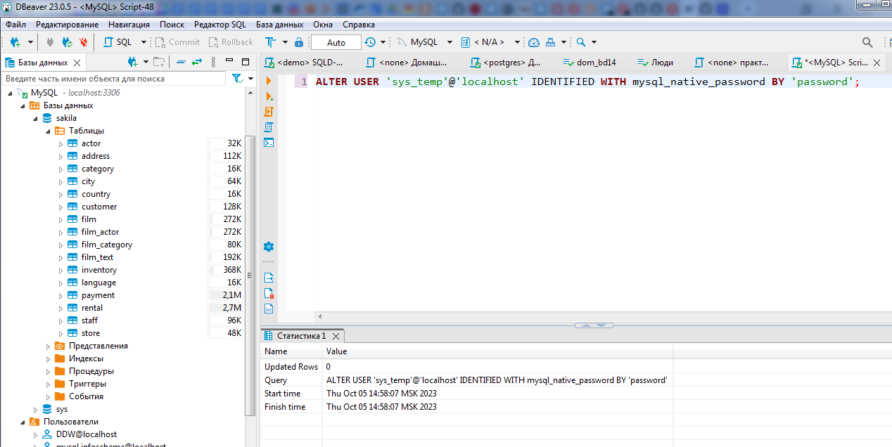

# Домашняя работа по теме «Работа с данными (DDL/DML)»

Детушев Дмитрий

Группа SQLDB-9

### Задание 1
1.1. Поднимите чистый инстанс MySQL версии 8.0+. Можно использовать локальный сервер или контейнер Docker.

1.2. Создайте учётную запись sys_temp. 

CREATE USER ‘sys_temp’@’localhost’ IDENTIFIED BY ‘password’;

1.3. Выполните запрос на получение списка пользователей в базе данных. (скриншот)

SELECT User,Host FROM mysql.user;

1.4. Дайте все права для пользователя sys_temp. 

GRANT ALL PRIVILEGES ON *.* TO ' sys_temp '@'localhost';

1.5. Выполните запрос на получение списка прав для пользователя sys_temp. (скриншот)

1.6. Переподключитесь к базе данных от имени sys_temp.

ALTER USER 'sys_test'@'localhost' IDENTIFIED WITH mysql_native_password BY 'password';

1.6. По ссылке https://downloads.mysql.com/docs/sakila-db.zip скачайте дамп базы данных.

1.7. Восстановите дамп в базу данных.

1.8. При работе в IDE сформируйте ER-диаграмму получившейся базы данных. При работе в командной строке используйте команду для получения всех таблиц базы данных. (скриншот)

### Задание 2
Составьте таблицу, используя любой текстовый редактор или Excel, в которой должно быть два столбца: в первом должны быть названия таблиц восстановленной базы, во втором названия первичных ключей этих таблиц. Пример: (скриншот/текст)

### Задание 3*
3.1. Уберите у пользователя sys_temp права на внесение, изменение и удаление данных из базы sakila.

REVOKE Delete ON sakila.* FROM 'sys_temp'@'localhost';
REVOKE Insert ON sakila.* FROM 'sys_temp'@'localhost';
REVOKE Update ON sakila.* FROM 'sys_temp'@'localhost';

Или

REVOKE INSERT, DELETE, UPDATE  ON sakila.* FROM 'sys_temp'@'localhost‘

